<div align="center">



<br><br>

### [**→ Open Z-Link**](https://org-karur-datacenter.github.io/Z--Link/)

<sub>No install. No account here. Your manuscript never leaves the tab.</sub>

<br>


</div>

<br>

---

Drop in a `.docx` with numbered citations and a plain bibliography. Z-Link finds each
reference across five indexes, verifies it is genuinely the right paper, adds the items to
your Zotero library, and returns the document with **live Zotero citations** in it — open
it in Word, nothing else to install or run.

It does **not** decide where a citation belongs — that is your judgment while writing.
Anything it cannot confirm becomes a visible `{NEEDS REVIEW: n}` rather than a live
citation quietly pointing at the wrong paper.

<br>

## Start

<table>
<tr>
<td width="50%" valign="top">

**In the browser** — nothing to install

1. [Open Z-Link](https://org-karur-datacenter.github.io/Z--Link/)
2. Paste your Zotero userID and API key
   <br><sub>the **First time here** button walks you through it</sub>
3. Drop in your `.docx`

</td>
<td width="50%" valign="top">

**On the command line**

```bash
pip install -r requirements.txt

python -m zotprep --zotero-userid 1234567 \
  --zotero-key KEY --save-credentials

python -m zotprep --manuscript paper.docx
```

<sub>Dry run is the default. Add `--live` to write.</sub>

</td>
</tr>
</table>

Then open the `.docx` in Word. The citations are Zotero field codes: Zotero asks for a
citation style the first time you refresh them, and **Add/Edit Bibliography** rebuilds the
reference list in that style.

<sub>A Scannable Cite copy for the <b>ODF Scan</b> plugin is produced alongside, for
LibreOffice or for checking the markers before they become citations — the plugin is
<a href="web/vendor/">bundled here</a>. It is no longer the main route: ODF Scan finds its
markers by scanning the file as text, and in a manuscript with images that can put a
citation inside a picture's XML and produce a file Word refuses to open.</sub>

<br>

## Why trust it

|  |  |
|:--|:--|
| **82 / 82 references** resolved across two real manuscripts, no manual pass | [details](docs/HOW-IT-WORKS.md#advisories) |
| **Acceptance is a conjunction**, never a score crossing a line. A wrong paper can fake one signal; it cannot fake the title, year, volume *and* first page together | [the accept gate](docs/HOW-IT-WORKS.md#the-accept-gate) |
| **It refuses rather than guesses.** Unconfirmed references stay visibly flagged | [advisories](docs/HOW-IT-WORKS.md#advisories) |
| **The browser engine is a verified port**, not a rewrite — compared against the Python original to the exact float, with 47/47 injected bugs caught | [verification](web/README.md) |
| **Nothing leaves your machine.** No server, no upload, no third-party script on the page | — |

<br>

## Two front ends, one engine

|  | Z-Link — browser | zotprep — CLI |
|:--|:--|:--|
| Install | none | `pip install -r requirements.txt` |
| Writes to Zotero | every run | only with `--live` |
| Preview without writing | — | `--dry-run`, the default |
| Remembers your decisions | for the session | forever, in SQLite |
| Separate bibliography file | — | `--bibliography` |

Use the CLI when you want a preview pass or decisions that persist.

<br>

## Documentation

| | |
|:--|:--|
| [**How it works**](docs/HOW-IT-WORKS.md) | Citation notation, the accept gate, advisories, providers, every flag |
| [**Verification**](web/README.md) | How the browser port is proven equivalent, and how to run it |
| [**Plugin notice**](web/vendor/NOTICE.md) | The bundled ODF Scan `.xpi`, its licence and provenance |

<br>

## Getting a Zotero key

At [zotero.org/settings/keys](https://www.zotero.org/settings/keys):

1. Your **userID** is the number in *"Your userID for use in API calls is …"* — not your
   username.
2. **Create new private key** → tick **Allow library access** *and* **Allow write
   access**. Missing the second one is the usual cause of an opaque `403`.
3. The key is shown once. Copy it immediately.

The key is stored in your browser only, and sent only to `api.zotero.org`.

<br>

## Layout

```
zotprep/     the engine and the CLI
web/         Z-Link — the browser build, its parity harnesses, the bundled plugin
docs/        how it works
```

<br>

---

<div align="center">
<sub>

Bundles [ODF Scan for Zotero](https://github.com/Juris-M/zotero-odf-scan-plugin) by Sebastian
Karcher and Frank Bennett · AGPL-3.0-or-later · [notice](web/vendor/NOTICE.md)

</sub>
</div>
